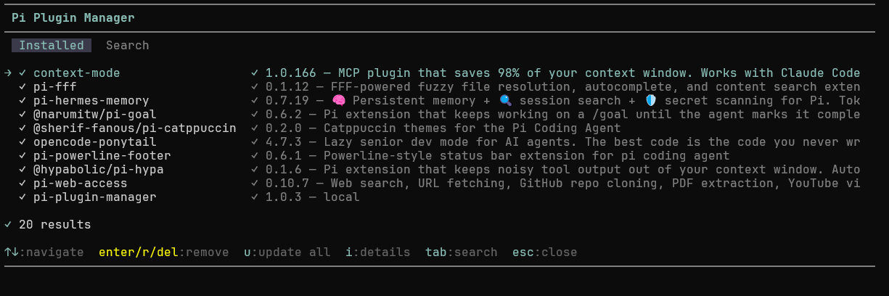
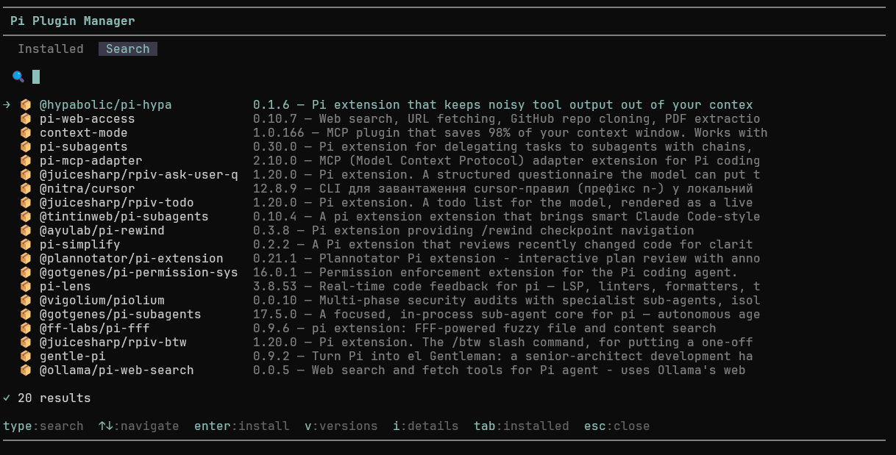

# pi-plugin-manager

<p align="center">
  <em>Browse, install, and remove Pi plugins — without leaving the terminal.</em>
</p>

<p align="center">
  
  
  
</p>

Ever installed a Pi plugin and then forgotten what it's called? Or installed ten of them and lost track of which ones need updating? **pi-plugin-manager** is the `/plugins` command that Pi should have shipped with — a terminal UI for everything your extensions, skills, and packages are doing.

Press `/plugins` and you get two tabs: **Installed** shows everything you've installed (with version numbers, descriptions, and update indicators). **Search** lets you browse the npm registry for `pi-package`-tagged packages — the ones designed to work with Pi. Install with enter, remove with r, update all with u. Spinners tell you when something's happening.

<p align="center">
  
</p>

<p align="center">
  
</p>

- **📋 Browse installed** — All your Pi plugins in one list with version numbers and descriptions
- **🔍 Search catalog** — Find Pi packages on npm by keyword, or just browse what's popular
- **📦 Install / 🗑 Remove** — Enter to install from search, r/del to remove from your list
- **⬆ Update all** — One key (`u`) updates every outdated package
- **📄 Package details** — Press `i` to see description, author, downloads, and publish date
- **📋 Version picker** — Press `v` on a search result to choose which version to install

## Usage

Install command:

```bash
pi install npm:pi-plugin-manager
```

Run in Pi with:

```bash
/plugins
```

## Keybindings

**Installed tab**

| Key                   | Action                         |
| --------------------- | ------------------------------ |
| `↑↓`                  | Navigate list                  |
| `PgUp` / `PgDn`       | Page up / down                 |
| `Enter` / `r` / `Del` | Remove selected (with confirm) |
| `u`                   | Update all packages            |
| `i`                   | Show package details           |
| `Tab`                 | Switch to search               |
| `Esc`                 | Back / Close                   |

**Search tab**

| Key           | Action                    |
| ------------- | ------------------------- |
| `↑↓`          | Navigate results          |
| `PgUp`/`PgDn` | Page up / down            |
| `Enter`       | Install selected          |
| `v`           | Choose version to install |
| `i`           | Show package details      |
| Type          | Search catalog            |
| `Tab`         | Switch to installed       |
| `Esc`         | Back / Close              |

## License

[MIT license](https://github.com/wyattferguson/pi-plugin-manager/blob/master/LICENSE)

## Contact + Support

Created by [Wyatt Ferguson](https://github.com/wyattferguson)

For any questions or comments heres how you can reach me:

### :octocat: Follow me on [Github @wyattferguson](https://github.com/wyattferguson)

### :mailbox_with_mail: Email me at [wyattxdev@duck.com](wyattxdev@duck.com)

### :tropical_drink: Follow on [BlueSky @wyattf](https://wyattf.bsky.social)

If you find this useful and want to tip me a little coffee money:

### :coffee: [Buy Me A Coffee](https://www.buymeacoffee.com/wyattferguson)
